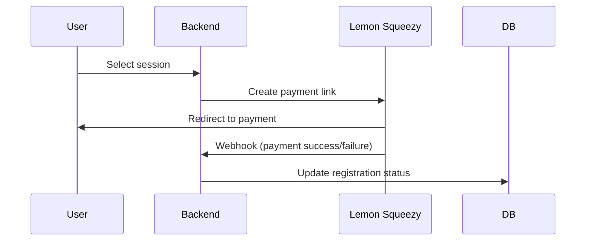

# Drivable

## Context

The application enables users to register for virtual reality driving training sessions. It solves the problem of providing accessible driving education through scheduled VR sessions, with payment processing and post-session performance tracking.

## Functional Requirements

- User authentication (sign-up/sign-in)

- Display available VR driving sessions with details (time, duration, price)

- Session registration with payment processing via Lemon Squeezy

- Post-session score updates visible in the mobile app

- Admin dashboard for managing sessions/viewing user data

## Use Cases

### End Users

- Browse Sessions: View available VR sessions with filtering by date/time

- Register for Session: Select session → Payment flow → Confirmation

- View Scores: See performance metrics after session completion

### Admins

- Manage Sessions: Create/update/delete VR session slots

- View Registrations: See participant lists for each session

## Data Model

### Users

```sql
id (PK) | email | password_hash | created_at
```


### Sessions

```sql
id (PK) | datetime | duration_minutes | max_capacity | price | instructor | created_at
```

### Registrations

```sql
id (PK) | user_id (FK) | session_id (FK) | payment_status | score | payment_id | created_at
```


### Relationships

    One user → Many registrations

    One session → Many registrations

## Implementation Details

### Backend (Spring Boot)

#### Authentication

 - Spring Security with JWT

 - Password hashing using BCrypt

#### Payment Flow





#### Score Updates

- Admins update scores via dashboard (PATCH /registrations/{id})

- Mobile app polls/WebSocket for score changes

## API Endpoints

### Auth

        POST /auth/signup - Create account

        POST /auth/login - Get JWT token

### Sessions

        GET /sessions - List available sessions

        POST /sessions (Admin) - Create new session

### Registrations

        POST /registrations - Initiate session booking

        POST /webhook/payments - Lemon Squeezy payment callback

## Privacy & Security

- All sensitive data (passwords, payment info) encrypted

- Lemon Squeezy handles PCI compliance

- JWT token expiration (1 hour)

- Role-based access control (user vs admin endpoints)

## Style Guide

### Spring Boot:

- Layered architecture (controller → service → repository)

- DTO pattern for API requests/responses

### Flutter:

  - BLoC state management

  - Feature-based folder structure

## Todo

- [ ] Implement the mailing a day before the session begins
